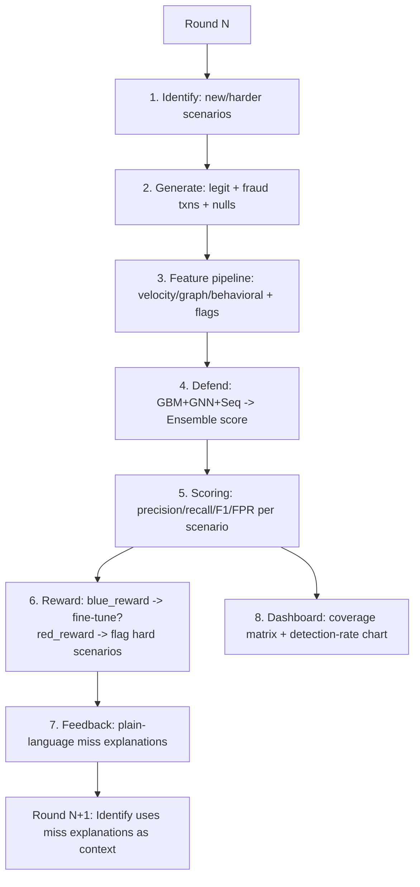

# Pahredaar: AI-Driven Fraud Red-Team Loop

A closed-loop security system where an LLM-driven **Red Team** invents novel fraud mechanisms, a synthetic **Generate** engine produces realistic UPI transactions embodying them, and a multi-model **Blue Team** learns to detect them — with each round's misses feeding back into the next round's attack design.

> **The Differentiator:** We didn't just train a classifier on Kaggle fraud data. We built a closed adversarial loop — an LLM proposing structurally distinct new fraud techniques, a simulator realizing them at the transaction level, and a defense ensemble that is scored, critiqued, and re-tested against its own misses, round over round.

---

## 🚀 Installation & Quick Start

1. **Clone the repository:**
   ```bash
   git clone https://github.com/KVarad777/Pahredaar.git
   cd Pahredaar/fraud-redteam-project_final
   ```

2. **Set up the backend environment:**
   ```bash
   cd siem-dashboard/backend
   python3 -m venv venv
   # On Windows use: venv\Scripts\activate
   source venv/bin/activate
   pip install -r ../../requirements.txt
   cd ../..
   ```

3. **Install Frontend Dependencies:**
   ```bash
   cd siem-dashboard/frontend
   npm install
   cd ../..
   ```

4. **Add your API Keys:**
   Create a `.env` file in the root directory and add your Groq API key:
   ```bash
   export GROQ_API_KEY="your_api_key_here"
   ```
   > **Architecture Note:** The high-parameter LLM (via Groq) is **strictly used by the Red Team** to intelligently invent novel fraud scenario patterns during training/simulation. The defensive ML models (Blue Team) do **not** rely on any external LLM APIs for live detection. They are standalone, lightweight models (LightGBM, GNN, LSTM) built for low-latency authorization.

5. **Run the SIEM Dashboard:**
   Use the provided start script to boot both the React frontend and the FastAPI Python backend simultaneously.
   ```bash
   chmod +x run.sh
   ./run.sh
   ```
   *Access the dashboard at `http://localhost:5173`*

---

## 📸 Interactive SIEM Dashboard

Pahredaar includes a fully-featured, tactical SIEM (Security Information and Event Management) dashboard to monitor the adversarial loop in real-time.

### Tactical Overview & Real-Time Threat Detection

*The main command center displaying the Blue Team's Ensemble F1 Score, Detection Rate, and dynamic tracking of Red vs Blue reward signals over multiple simulation rounds.*

> **The Adversarial Learning Curve:** Look at the "Detection Efficacy over Rounds" chart in the dashboard image above. You can actively see the system learning! In round 2, the Red Team discovered a massive vulnerability, causing the Blue Team's F1 Score and Precision to plummet. However, because this is a closed-feedback loop, the Blue Team analyzed its misses, extracted new features, and by Round 4, the F1 Score rebounded back to peak levels as it successfully learned to block the new attack.

### Live Security Alerts & Threat Ticker

*Intercepts the live transaction stream, isolating and flagging synthetic attacks generated by the Red Team in a high-visibility alert feed.*

### Scenario Coverage Matrix

*A dynamic matrix tracking the diverse categories of fraud (Network, Behavioral, Identity) generated by the Red Team, alongside the Blue Team's detection rate for each specific threat.*

### Interactive Project Documentation

*Built-in documentation detailing the F3 Taxonomy and architectural approach directly within the SIEM interface.*

---

## 🧠 System Architecture



### The Core Components:
1. **Red Team (Identify):** LLM scenario proposer aligned with the MITRE F3 taxonomy. Includes a structural-distinctness validator to prevent duplicate attacks.
2. **Generate Engine:** Simulates legitimate traffic (log-normal amounts, diurnal timing) and injects highly-fidelity fraud transactions based on the Red Team's designs.
3. **Blue Team (Defend):** A multi-model ensemble featuring:
   - **GBM (LightGBM):** Fast, tabular feature evaluation.
   - **GNN (GraphSAGE):** 2-hop subgraph analysis for ring/mule detection.
   - **Sequence Model (LSTM):** Evaluates the last-N transactions for behavioral anomalies.

> 📚 **Deep Dive:** Want to know exactly how the LLM Identify Engine works or how the Feature Pipeline bridges the gap? Check out the **[Detailed Architecture Breakdown](docs/architecture_details.md)** for a deep dive into the inner workings of both the Red and Blue teams.

---

## 📊 System Performance Metrics

Based on the latest locked evaluation run (12 distinct scenarios over 4 adversarial rounds):

| Metric | Performance |
|---|---|
| **Avg Ensemble AUC** | **0.911** |
| **False Positive Rate (FPR)** | **0.0181** (1.8%) |
| **Avg Recall** | 0.538 |
| **Avg Precision** | 0.373 |
| **Generalization (Unseen Scenario)** | **100% Detection (17/17)** |

*Note: Precision appears ostensibly low entirely due to the realistic, highly imbalanced base fraud rate (1.05% of all simulated traffic). An AUC of 0.911 reflects true, high-fidelity separability.*

### Diverse Threat Coverage
The Red Team successfully generated structurally distinct attacks across multiple vectors:
- **Network-based:** 5 distinct scenarios (e.g., Mule Networks, Rotating Proxies)
- **Behavioral:** 4 distinct scenarios (e.g., Velocity Surges, Bot Orchestration)
- **Identity-based:** 2 distinct scenarios (e.g., Synthetic KYC Bypass)
- **AI-Specific:** 1 distinct scenario (e.g., Deepfake Liveness Evasion)

---

## 🏗️ Repository Structure

```
fraud-redteam-project/
├── config/                # Schema, MITRE F3 taxonomy, and baseline distribution params
├── data/                  # Generated synthetic transactions, logs, and coverage matrices
├── src/
│   ├── identify/          # LLM Scenario generation and F3 taxonomy alignment
│   ├── generate/          # UPI synthetic transaction engine and data injectors
│   ├── features/          # Velocity stores, Graph states, and feature assemblers
│   ├── defend/            # Blue Team Models (GBM, GNN, LSTM, Ensemble)
│   ├── reward/            # Loop orchestration and scoring logic
│   └── feedback/          # Plain-language miss explanation engine
├── notebooks/             # Step-by-step Jupyter notebooks for training and validation
└── siem-dashboard/        # Interactive React/FastAPI Dashboard
```

---

## ⚡ Deployment & Feasibility

- **Latency:** The GBM and Ensemble Logistic Regression models are optimized for sub-second, inline scoring at authorization time. The heavier GNN/Sequence models can operate as near-real-time enrichment signals.
- **Data Privacy by Design:** The entire system operates on 100% synthetic, schema-correct data fitted from real-world parameters (IEEE-CIS, PaySim). This allows for maximum adversarial red-teaming with zero real-customer PII risk.
