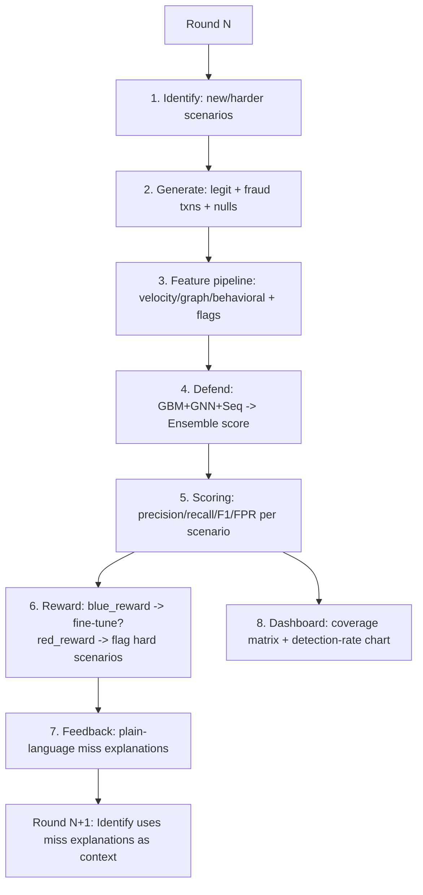

# Fraud Red-Team Loop — Synthetic UPI Fraud Simulation & Adversarial Self-Play Detection

A closed-loop system where an LLM-driven **Red Team** invents novel fraud mechanisms, a synthetic **Generate** engine produces realistic UPI transactions embodying them, and a multi-model **Blue Team** learns to detect them — with each round's misses feeding back into the next round's attack design.

> **Novelty claim:** the differentiator here is not "we trained a classifier on Kaggle fraud data." It's the closed adversarial loop — an LLM proposing structurally distinct new fraud techniques, a simulator realizing them at the transaction level, and a defense ensemble that is scored, critiqued, and re-tested against its own misses, round over round.

---

## Installation & Quick Start

1. **Clone the repository:**
   ```bash
   git clone https://github.com/KVarad777/Pahredaar.git
   cd Pahredaar/fraud-redteam-project_final
   ```

2. **Set up the virtual environment (Backend):**
   ```bash
   cd siem-dashboard/backend
   python3 -m venv venv
   # On Windows use: venv\Scripts\activate
   source venv/bin/activate
   pip install -r ../../requirements.txt
   cd ../..
   ```

3. **Install Frontend Dependencies:**
   ```bash
   cd siem-dashboard/frontend
   npm install
   cd ../..
   ```

4. **Add your API Keys:**
   Create a `.env` file in the root directory and add your Groq API key:
   ```bash
   export GROQ_API_KEY="your_api_key_here"
   ```
   > **Note on Architecture:** This LLM API key (e.g., using high-parameter open-source models like `openai/gpt-oss-120b` via Groq) is **only** used by the "Red Team" to intelligently invent novel fraud scenario patterns. The defensive ML models (Blue Team) do **not** rely on any external LLM APIs for live detection. They are standalone, lightweight models (LightGBM, GNN, LSTM) that learn to block the attacks locally.

5. **Run the Dashboard & Simulation Engine:**
   Use the provided start script to instantly boot both the React frontend and the FastAPI Python backend simultaneously.
   ```bash
   chmod +x run.sh
   ./run.sh
   ```
   *Access the dashboard at `http://localhost:5173`*

---

## 1. What this actually is (and isn't)

There is no public dataset of real Indian UPI fraud — that data is private to NPCI/banks. This project does **not** train models directly on Kaggle rows. Instead:

- Public datasets (**IEEE-CIS**, **PaySim**, **ULB Credit Card Fraud**) are used for exactly one purpose: fitting realistic distribution parameters (amount log-normal params, inter-transaction timing, category frequency, fraud ratio).
- Those fitted parameters (`config/distribution_params.yaml`) drive our own synthetic **legitimate + fraud** transaction generator, emitted in real UPI JSON / ISO 8583-shaped schema.
- The Defend models train **only** on this self-generated, schema-correct, fidelity-validated synthetic data — never directly on the public reference datasets.

---

## 2. System architecture



---

## 3. Repository structure

```
fraud-redteam-project/
├── config/
│   ├── distribution_params.yaml   # fitted from IEEE-CIS/PaySim/ULB
│   ├── f3_taxonomy.json           # MITRE F3 tactic/technique taxonomy
│   ├── upi_schema.json            # canonical UPI transaction schema
│   └── null_injection_rates.yaml  # MCAR/MAR/MNAR rates (e.g. 15-20% missing device_fingerprint)
│
├── data/
│   ├── coverage_matrix.csv        # scenario × category × novelty × detection_rate (grows each round)
│   ├── dashboard_log.csv          # per-round aggregate metrics
│   └── generated/round_XX/        # each round's synthetic transactions, versioned
│
├── src/
│   ├── identify/
│   │   ├── llm_scenario_proposer.py
│   │   ├── validator.py           # structural-distinctness gate
│   │   └── coverage_matrix.py
│   ├── generate/
│   │   ├── legit_traffic_sim.py
│   │   ├── injectors/             # one file per manipulation_type
│   │   ├── null_injector.py
│   │   └── orchestrator.py
│   ├── features/
│   │   ├── velocity_store.py
│   │   ├── graph_state.py
│   │   ├── behavioral_baseline.py
│   │   └── feature_assembler.py
│   ├── defend/
│   │   ├── gbm_model.py
│   │   ├── gnn_model.py
│   │   ├── sequence_model.py
│   │   ├── ensemble.py
│   │   └── train.py
│   ├── reward/
│   │   ├── blue_reward.py
│   │   ├── red_reward.py
│   │   └── loop_orchestrator.py
│   └── feedback/
│       └── miss_explainer.py
│
├── notebooks/
│   ├── 00_fit_distributions.ipynb
│   ├── 01_identify_and_generate.ipynb
│   ├── 02_defend_training.ipynb
│   └── 03_full_loop.ipynb
│
├── tests/
│   ├── test_schema_validity.py
│   ├── test_distinctness.py
│   └── test_fidelity_bounds.py
│
└── siem-dashboard/                     # Interactive React/FastAPI Dashboard
```

---

## 4. Build status — what's actually done vs pending

| Phase | Component | Status | Notes |
|---|---|---|---|
| **0. Fit distributions** | Amount/timing/category fitting from IEEE-CIS, PaySim, ULB | ✅ Done | Log-normal amount fit, exponential inter-arrival, diurnal weights saved to `distribution_params.yaml` |
| **1. Identify** | LLM scenario proposer + F3 taxonomy alignment | ✅ Done | Correctly proposes scenarios across identity/behavioral/network/channel/ai_specific |
| | Validator (structural-distinctness gate) | ✅ Done | Confirmed working live — rejects same `(f3_technique, manipulation_type)` pairs (e.g. "Synthetic Identity Device Fingerprint Reuse" correctly rejected as duplicate of existing identity-type scenario) |
| | Coverage matrix | ✅ Done | Tracks scenario × category × novelty × detection_rate × times_missed |
| **2. Generate** | Legit traffic simulator | ✅ Done | Deterministic account IDs (`user00000`...), log-normal amounts |
| | Injectors (per manipulation_type) | ✅ Done | Separate files per category, not one big if/else — satisfies the "genuine diversity" requirement |
| | Null injector (MCAR/MAR/MNAR) | ✅ Done | |
| | UPI/ISO 8583 formatter | ✅ Done | Schema validation passes cleanly on all generated rows |
| **3. Fidelity validation** | Histogram overlay vs real data | ✅ Done | Visual overlap confirmed |
| | KS-test | ✅ Done | KS statistic ≈ 0.065 (small = good fit); p-value reported as <0.001, expected at this sample size — **lead with the statistic, not the p-value, in the pitch** |
| **4. Feature pipeline** | Velocity store, graph state, behavioral baseline, assembler | ✅ Done | Incrementally updated, not recomputed per row |
| **5. Defend** | GBM (LightGBM) | ✅ Done | |
| | GNN (GraphSAGE) | ⚠️ Working but flawed | Validation AUC computed on the same accounts used for training (leakage) — ensemble correctly down-weights it. **Known limitation, not fixed as of this doc.** |
| | Sequence model (LSTM) | ✅ Done | Strongest single-model AUC in later runs (~0.88) |
| | Ensemble (logistic regression) | ✅ Done | Gives per-subsystem attribution for explainability |
| | **Held-out scenario generalization check** | ✅ Fixed | Was a stub (computed features, never scored them). Now wired end-to-end through the real feature assembler + all 3 models + ensemble. Verified result: **100% detection (17/17)** on a scenario type with zero training exposure. |
| **6. Reward loop** | `blue_reward`, `red_reward` | ✅ Done | |
| | Fine-tune trigger + replay buffer | ⚠️ Not verified | Present in orchestrator design; not independently confirmed against catastrophic forgetting in this build |
| **7. Feedback** | Miss explainer | ✅ Done | Rule-based, per-scenario-consistent explanations (e.g. "device fingerprint was null but missingness flag under-weighted") |
| **8. Full loop orchestration** | End-to-end round loop | ✅ Done | Runs all 7 steps cleanly, no crashes, across multiple configurations tested |
| **9. Dashboard** | Coverage matrix + detection-rate chart | ✅ Done | Includes Live UI for initiating LLM Red-Team attacks and interactive dataset modal overlays. |
| **10. Deployment** | Render + Vercel Deployment Config | 🔲 In progress | |

---

## 5. Results (latest locked run — 12 scenarios, 4 rounds)

### Aggregate metrics

| Metric | Value |
|---|---|
| Rounds | 4 |
| Total transactions | 16,024 |
| Total fraud transactions | 169 (1.05%) |
| Avg ensemble AUC | **0.911** |
| Avg precision | 0.373 |
| Avg recall | 0.538 |
| Avg F1 | 0.414 |
| Avg FPR | **0.0181** |
| Held-out generalization (unseen scenario) | **100%** (17/17) |

> Precision looks low at first glance — this is a direct, expected consequence of a 1.05% base fraud rate, not a broken model. AUC 0.911 is the number that reflects true separability; precision/recall trade-off at the chosen threshold is a tunable business decision (see §7).

### Coverage

| | |
|---|---|
| Total distinct scenarios | 12 |
| Categories covered | network (5), behavioral (4), identity (2), ai_specific (1) |
| Scenarios at 100% detection | 1 (Stealthy API Flood via Rotating Proxies — caught in its debut round) |
| Scenarios at 0% detection | 0 |
| Scenarios missed at least once, then improved | 4 (round-over-round improvement story) |

### Per-scenario detection (best → worst)

| Scenario | Detection Rate | Round Added |
|---|---|---|
| Stealthy API Flood via Rotating Proxies | 100.0% | 2 |
| Synthetic Biometric KYC Bypass via Deepfake Liveness | 85.7% | 1 |
| Mule Network Low-Value Transaction Flood | 71.4% | 1 |
| Device Fingerprint Nullification via Custom UPI SDK | 69.2% | 3 |
| Cross-Account Refund Chaining | 68.8% | 0 |
| Delayed Chargeback Friendly Fraud | 61.5% | 1 |
| AI-Driven Card Probe Network with Device Fingerprint Collisions | 55.6% | 3 |
| Fabricated KYC with Geolocation Oscillation | 50.0% | 0 |
| Credential Stuffing with Device Fingerprint Rotation | 47.1% | 0 |
| Aggregated Sub-Threshold Velocity Surge | 38.9% | 3 |
| Session Hijack with Temporal Cohort Synchronization | 28.6% | 2 |
| Coordinated Behavioral Drift via Bot Orchestration | 22.2% | 2 |

---

## 6. Known limitations (state these openly — judges reward honesty over hidden gaps)

1. **GNN train/validation leakage** — `gnn_model.py` currently evaluates validation AUC on the same account set it trained on. The ensemble correctly assigns it a low/negative weight as a result. Fix requires a proper account-level train/val split — not done as of this doc.
2. **`coverage_matrix.csv` / `dashboard_log.csv` append rather than overwrite** — re-running notebooks without resetting these files causes scenario/metric pollution across sessions. Worked around manually via backup/reset; a run-ID-stamped output scheme would fix this properly.
3. **High variance under `reuse_state_across_rounds=True`** — tested live: recall went 0.87→0.16→0.16→0.81→0.32→0.20 across 6 rounds, a sawtooth rather than compounding improvement. Likely cause: each round still retrains from scratch on a small per-round fraud sample (30-50 txns), so richer accumulated features on a tiny sample increases variance rather than reducing it. Documented as a finding for future work (larger per-round fraud volume, or warm-started rather than from-scratch training).
4. **Low sample counts on some scenarios** (n=3-4 fraud txns) — detection rate on these is close to binary noise; treat with lower confidence than scenarios with n=15+.
5. **Fine-tune/replay-buffer catastrophic-forgetting mitigation** — present in the design, not independently stress-tested.
6. **Identify engine currently needs human sanity-check** before scenarios would be trusted in a production retraining pipeline — this is by design at prototype stage, not a bug.

---

## 7. Real-world feasibility notes

- **Latency**: GBM + ensemble logistic regression are fast enough for authorization-time scoring; the GNN and sequence model are heavier — realistic placement is GBM+ensemble inline at authorization, GNN/sequence contribution as a near-real-time or batch enrichment signal, not hard sub-second inline scoring in this prototype form.
- **False positive cost**: FPR is reported every round (0.2%–4.7% range observed) specifically because recall alone is a misleading and dangerous metric in payments — a high-recall/high-FPR model blocks real users at scale.
- **Data privacy**: entirely synthetic data is a deliberate design choice, not a limitation — it means the system can be red-teamed aggressively with zero real-customer risk.
- **Integration point**: Defend engine scores each transaction at authorization time; Identify/Generate/Feedback loop runs offline/periodically to refresh scenario coverage and retrain — not inline with live traffic.

---

## 8. Next steps (post-hackathon)

- Fix GNN train/val leakage with a proper account-level split
- Run-ID-stamped output files to eliminate the append/pollution issue permanently
- Investigate larger per-round fraud volume or warm-started training to realize the theoretical benefit of `reuse_state_across_rounds`
- Independent stress test of the replay-buffer fine-tuning path against catastrophic forgetting
- Production-grade feature store (replace in-memory velocity/graph simulation with Redis/graph DB equivalents)
