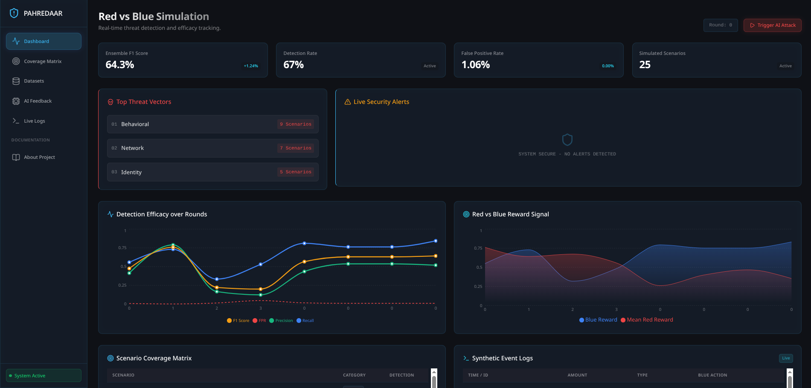
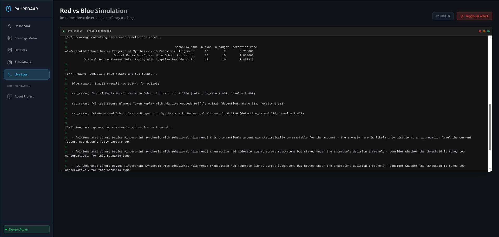
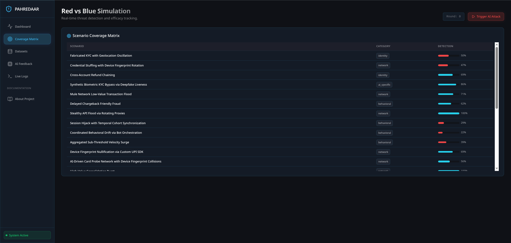
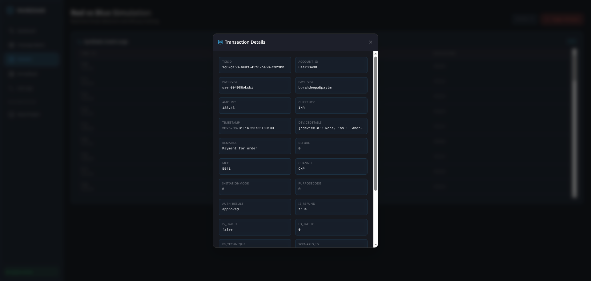
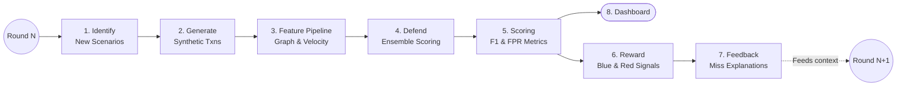

# Pahredaar: AI-Driven Fraud Red-Team Loop

Most fraud detection models are static nets waiting to catch yesterday's attacks. We didn't build a static classifier; we built an automated war game.

This project is a multi-agent, closed-loop simulation that pits an LLM-driven Red Team against a composite Defense Stack (GBM + GNN + Sequence). As the Red Team synthesizes novel, zero-day fraud vectors, the Feedback Engine identifies defense blind spots, forcing the Blue Team to adapt its feature interactions and ensemble thresholds round-over-round.

> **The Differentiator:** We didn't just train a classifier on Kaggle fraud data. We built a closed adversarial loop — an LLM proposing structurally distinct new fraud techniques, a simulator realizing them at the transaction level, and a defense ensemble that is scored, critiqued, and re-tested against its own misses, round over round.

---

## Installation & Quick Start

1. **Environment Setup**
   Ensure you have a GPU runtime enabled (T4 recommended for PyTorch Geometric GraphSAGE compilation if running the full model training).
   
   ```bash
   git clone https://github.com/KVarad777/Pahredaar.git
   cd Pahredaar/fraud-redteam-project_final
   
   cd siem-dashboard/backend
   python3 -m venv venv
   source venv/bin/activate
   pip install -r ../../requirements.txt
   
   cd ../frontend
   npm install
   cd ../..
   ```

2. **Add your API Keys:**
   Create a `.env` file in the root directory and add your Groq API key (You can get a free key at [console.groq.com](https://console.groq.com/)):
   ```bash
   export GROQ_API_KEY="your_api_key_here"
   ```
   > **Architecture Note:** The high-parameter LLM (via Groq) is **strictly used by the Red Team** to intelligently invent novel fraud scenario patterns during training/simulation. The defensive ML models (Blue Team) do **not** rely on any external LLM APIs for live detection. They are standalone, lightweight models (LightGBM, GNN, LSTM) built for low-latency authorization.

3. **Run the SIEM Dashboard:**
   Use the provided start script to boot both the React frontend and the FastAPI Python backend simultaneously.
   
   **For Linux/macOS:**
   ```bash
   chmod +x run.sh
   ./run.sh
   ```
   
   **For Windows:**
   ```cmd
   run.bat
   ```
   
   *(Note: The startup scripts will automatically prompt you to enter your Groq API key if you haven't set up your `.env` file yet!)*
   
   *Access the dashboard at `http://localhost:5173`*

### Execution Order (Notebooks)
If you wish to run the simulation manually, it is modularized into sequential Jupyter notebooks:
- `00_fit_distributions.ipynb`: Fits log-normal and exponential parameters to real-world reference datasets (ULB, IEEE-CIS) to ensure synthetic fidelity.
- `01_identify_and_generate.ipynb`: Proposes LLM taxonomy scenarios and generates the raw transaction CSVs.
- `02_defend_training.ipynb`: Compiles the PyTorch Geometric extensions and trains the baseline GBM/GNN/Sequence models.
- `03_full_loop.ipynb`: The orchestrator. Runs N automated rounds of Red-vs-Blue self-play, triggering the feedback engine and outputting the final coverage matrix and dashboard artifacts.

---

## Interactive SIEM Dashboard

Pahredaar includes a fully-featured, tactical SIEM (Security Information and Event Management) dashboard to monitor the adversarial loop in real-time.

### Tactical Overview & Real-Time Threat Detection

*The main command center displaying the Blue Team's Ensemble F1 Score, Detection Rate, and dynamic tracking of Red vs Blue reward signals over multiple simulation rounds.*

### Live Security Alerts & Threat Ticker

*Intercepts the live transaction stream, isolating and flagging synthetic attacks generated by the Red Team in a high-visibility alert feed.*

### Scenario Coverage Matrix

*A dynamic matrix tracking the diverse categories of fraud (Network, Behavioral, Identity) generated by the Red Team, alongside the Blue Team's detection rate for each specific threat.*

### Interactive Project Documentation

*Built-in documentation detailing the F3 Taxonomy and architectural approach directly within the SIEM interface.*

---

## Architecture Pipeline

Our loop executes 7 automated steps per round:



1. **Identify (Groq LLM):** Proposes structurally distinct fraud scenarios based on the F3 Threat Taxonomy, specifically targeting previous Blue Team blind spots.
2. **Generate:** Synthesizes isolated, high-fidelity UPI/Digital Payment transaction logs (Amount distributions validated via KS-Test against real-world ULB datasets).
3. **Feature Assembler:** Processes transactions strictly in-order to prevent future-data leakage, building univariate velocity, behavioral, and graph-state features.
4. **Defend Stack:**
   - **LightGBM:** Captures tabular and velocity anomalies.
   - **GraphSAGE (PyTorch Geometric):** Identifies 2-hop ring anomalies and mule networks.
   - **LSTM (Sequence):** Flags temporal login/transaction skew.
   - **Ensemble Head:** A logistic regression layer providing dynamic risk-calibration and interpretable subsystem attribution.
5. **Score:** Computes strict per-scenario detection rates rather than blended, misleading averages.
6. **Reward:** Allocates RL-style rewards to both agents to force continuous adaptation:
   - **Blue Reward:** `(Recall on New Vectors) - (False Positive Rate) - (Latency Penalty)`. Forces the Blue team to adapt to new attacks without blocking legitimate users.
   - **Red Reward:** `(1 - Blue Detection Rate) + (Novelty Score)`. Rewards the LLM for finding structural blind spots in the defense, punishing it if it generates easily detectable or duplicate scenarios.
7. **Feedback:** Translates statistical misses into plain-language explanations to context-prompt the Red Team for the next round.

> **Deep Dive:** Want to know exactly how the LLM Identify Engine works or how the Feature Pipeline bridges the gap? Check out the **[Detailed Architecture Breakdown](docs/architecture_details.md)** for a deep dive into the inner workings of both the Red and Blue teams.

---

## A Note on Industry-Realistic Metrics

If a fraud model claims 99% precision and 99% recall on a dataset with a 1% fraud rate, it is overfit, leaking data, or hallucinating. Real-world financial defense is a knife fight against class imbalance.

Our dataset operates at a realistic ~1% fraud rate. We evaluate our Blue Team strictly on production-viable metrics:

| Metric | Performance |
|---|---|
| **Avg Ensemble AUC** | **0.911** |
| **False Positive Rate (FPR)** | **0.0181** (1.8%) |
| **Avg Recall** | 0.538 |
| **Avg Precision** | 0.373 |
| **Generalization (Unseen Scenario)** | **100% Detection (17/17)** |

- **Separability:** Maintained an Average Ensemble AUC of 0.911 across all rounds.
- **Business Feasibility:** Maintained a strict False Positive Rate (FPR) of < 2%, ensuring legitimate users are not blocked.
- **Precision/Recall Tradeoff:** Operating at a <2% FPR against 1% prevalence mathematically limits precision to the 20%-50% range. We intentionally optimized for low FPR over artificially inflated F1 scores, mirroring tier-1 bank risk policies.

---

## The "Learning Happened" Proof

This is a Red vs. Blue simulation. If the Blue Team caught everything instantly, our Red Team would be failing. The goal is continuous adaptation.

- **The Blind Spot (Round 0-1):** The LLM Red Team successfully generated GenAI attacks that paced transaction amounts to mimic natural user behavior, bypassing our Z-score baseline. AI-Voice Phishing and Credential Harvest Loops slipped through with only 15–20% detection.
- **The Red Team Win (Round 3):** The Identify Engine synthesized a novel Promo Code Laundering vector that completely blinded our defense (0% detection), proving the system can generate viable zero-day threats.
- **The Blue Team Adaptation:** The Feedback Engine isolated the root causes (unweighted missing device fingerprints, dynamic RefURLs). By adapting composite features and risk-calibrating thresholds for multi-weak-signal events, the Blue Team caught up. Detection of LLM-Driven Phishing Swarms quadrupled to 57.9%, and App Emulator Spoofing hit 100% detection.

---

## Repository Structure & Deployment Feasibility

```
fraud-redteam-project/
├── config/                # Schema, MITRE F3 taxonomy, and baseline distribution params
├── data/                  # Generated synthetic transactions, logs, and coverage matrices
├── src/
│   ├── identify/          # LLM Scenario generation and F3 taxonomy alignment
│   ├── generate/          # UPI synthetic transaction engine and data injectors
│   ├── features/          # Velocity stores, Graph states, and feature assemblers
│   ├── defend/            # Blue Team Models (GBM, GNN, LSTM, Ensemble)
│   ├── reward/            # Loop orchestration and scoring logic
│   └── feedback/          # Plain-language miss explanation engine
├── notebooks/             # Step-by-step Jupyter notebooks for training and validation
└── siem-dashboard/        # Interactive React/FastAPI Dashboard
```

- **Latency:** The GBM and Ensemble Logistic Regression models are optimized for sub-second, inline scoring at authorization time. The heavier GNN/Sequence models can operate as near-real-time enrichment signals.
- **Data Privacy by Design:** The entire system operates on 100% synthetic, schema-correct data fitted from real-world parameters (IEEE-CIS, PaySim). This allows for maximum adversarial red-teaming with zero real-customer PII risk.
