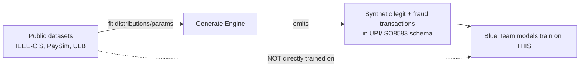

# In-Depth System Architecture

This document breaks down the specific implementation details, theoretical approach, and validation checkpoints for both the Red Team (Identify + Generate) and Blue Team (Defend + Reward) phases of Pahredaar.

---

## 1. The Core Differentiator: Synthetic Data Generation

A common misconception in fraud detection projects is the reliance on static, downloaded datasets. **There is no existing public dataset of real Indian UPI fraud transactions.**

Instead of training a model directly on public Kaggle rows (which is highly limited), Pahredaar uses public datasets (IEEE-CIS, PaySim, ULB) for exactly one purpose: **fitting realistic distribution parameters**. 

These parameters (e.g., log-normal transaction amounts, inter-transaction timing, fraud ratios) are then injected into our custom Simulator. 

This guarantees that the Blue Team learns from dynamic, structurally distinct fraud techniques designed by the LLM, rather than memorizing static CSV rows.

---

## 2. Red Team Engine (Identify & Generate)

The Red Team operates in two phases before the Blue Team is ever involved.

### Phase 1: Identify Engine (LLM Scenario Generation)
1. **Taxonomy Alignment**: Operates on a structured MITRE F3 taxonomy.
2. **Scenario Proposer**: An LLM (via Groq API) acts as a specialized red-teamer to propose novel attack mechanisms.
3. **Validator Gate**: Rejects scenarios whose `(fields_manipulated, manipulation_type)` combo already exists, ensuring the Blue Team is always facing *genuinely distinct* scenarios (e.g. Identity vs Behavioral vs Network attacks).
4. **Coverage Matrix**: Approved scenarios are written to the live `coverage_matrix.csv`.

### Phase 2: Generate Engine
1. **Legitimate Traffic Simulation**: Generates a baseline stream of realistic non-fraud UPI transactions using the fitted distribution parameters (log-normal amounts, diurnal timings).
2. **Fraud Injectors**: Distinct modules (not just nested if-statements) inject fraud mechanisms directly into the legitimate traffic based on the LLM's scenario design.
3. **Null Injector**: Implements MCAR/MAR/MNAR logic to simulate missing data (e.g., dropped device fingerprints).
4. **UPI/ISO 8583 Formatter**: Emits the final output in a strict, realistic JSON schema.

---

## 3. Blue Team Engine (Defend)

The Blue Team utilizes a sophisticated Feature Pipeline and a multi-model architecture.

### Feature Pipeline (The Bridge)
Stateful lookups are incrementally updated *before* the transaction arrives.
- **Velocity Store**: Running 1h/24h/7d incremental counters.
- **Graph State**: Device/IP/account adjacency tracking.
- **Behavioral Baseline**: Per-account rolling stats.
- **Feature Assembler**: Concatenates raw fields + velocity + graph + missingness flags into a single vector.

### Model Architecture
The assembled feature vector is fed into a 3-part ensemble:
1. **GBM (LightGBM)**: Evaluates the full flat feature vector (fastest to train, serves as the tabular baseline).
2. **GNN (GraphSAGE)**: Analyzes the 2-hop subgraph around the account for ring/mule detection.
3. **Sequence Model (LSTM)**: Evaluates the last `N` transactions as an ordered sequence to detect behavioral anomalies.
4. **Logistic Ensemble**: Combines the scores from all three models into a final fraud probability, providing per-subsystem attribution for explainability.

---

## 4. The Reward Loop (Adversarial Self-Play)

This is the core loop that orchestrates the entire simulation, allowing both sides to learn from each other.

- **Blue Reward**: `(Recall on New Techniques) - (False Positive Rate) - (Latency Penalty)`. If this drops below a threshold, the Blue Team fine-tunes on a hard-negative replay buffer to prevent catastrophic forgetting.
- **Red Reward**: `(1 - Blue Detection Rate) + (Novelty Score)`. Missed scenarios are flagged back to the Identify engine as instructions to "generate harder variants of *this* specific technique."

### Miss Explainer (Feedback Engine)
After each round, the system generates plain-language reasons for missed transactions (e.g., *"amount stayed within normal bounds, but graph centrality spike wasn't weighted"*). This feedback is directly injected into the LLM prompt for the next round, officially closing the loop.
